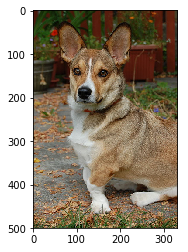
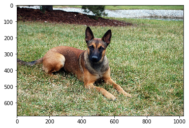
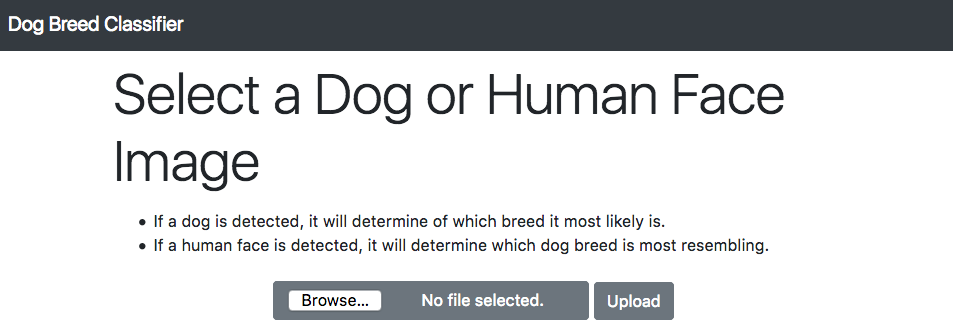
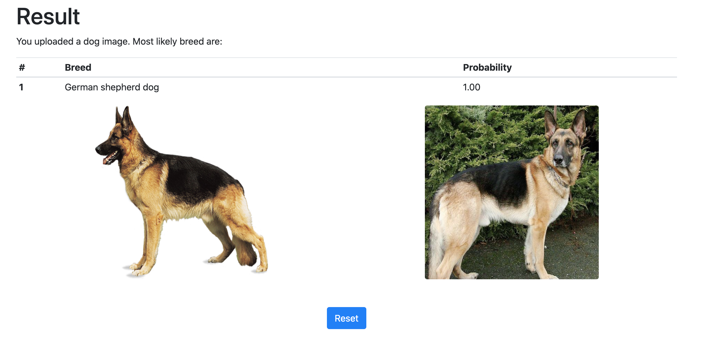

## Project Overview

For my Data Science Nano Degree capstone project, I chose Dog Breed Classifier.

This project uses CNN + Transfer learning to identify dog breeds from the submitted images. 

1. Convolutional Neural Networks (CNNs) are commonly used to analyse image data.
2. Transfer learning is a technique that allows to reuse a model across different tasks.

The objective is to identify the breed of a dog, and as a ester egg, if you provide a human image, it will tell you which dog breed does it resemble the most :laughing: 

I chose this project, because I like Computer Vision as a field and wanted to get my hands dirty with it. 
Another motivation was dogs, I love them 😍.

### Table of contents

1. Problem Statment
2. Metrics
3. Data Exploration
4. Data Visualization
5. Data Preprocessing
6. Implementation
7. Refinement
8. Model Evaluation and Validation
9. Justification
10. Reflection
11. Improvements
12. Used Libraries
13. File Description
14. Findings
15. Web App Description

### Problem Statment

To identify breed of a dog from an image, from a total of 133 breeds.

### Metrics

The metric I chose to evaluate the performace of model is `accuray` which is defined as  
$$
\frac{Number\,of\,correct\,predictions}{Total\,number\,of\,predictions}
$$
### Data Exploration

I used two datasets for this project:

- Dog Breed Dataset 
  - There were a total of `8351` images in this dataset.
  - There were `133` total classes, in other words `133` breeds of dogs.
  - I used `6680` of these for training.
  - `835` for validation and `836` for testing purposes.
- Human Images 
  - There were a total of `13233` images in this dataset.
  - I used openCV's prebuilt filter to identy faces from these images so splitting into training and testing wasn't required.

> Both datasets were provided by Udacity.

### Data Visualization

There were varying sized images of dogs, such as:

 

### Data Preprocessing

To tackle this problem of varied sized images I utilized `keras.preprocessing` module's `image` utility and read all images into a same block size of `224*224` and then converted it into a `numpy.ndarray` object for further processing.
I didn't think conversion to grayscale was needed because CNN's can learn from the color value as well.

### Implementation

After following through the provided models and doing some experimentation, I had two models at hand, one was **VGG16** and the other was **ResNet50**, both pretrained on `imagenet`, for dog breed classification. 

### Refinement

After giving some pases with different parameters, I settled for **ResNet50**, played around a little bit more to find good epochs number with minimum computation and best/acceptable results.

### Model Evaluation and Validation

I used a seperate validation set, that was used in the training passes.
With `epochs=20` and `batch_size=20` I got 

```python
training_loss: 0.0064
training_acc: 0.9987
val_loss: 0.9667
val_acc: 0.8180
```

Then, finally evaluated the model on test set and got a **accuracy of 81.1%**

### Justification

I preferred ResNet50 over VGG16 because of good performance.
VGG16 has too many trainable parameters and I didn't have enough data to train all of them well enough.
Whereas ResNet50, because of it's comparatively smaller size was able to learn good enough without too many epochs.

### Reflection

I believe ResNet50 was a good choice mainly because of it's less trainable parameters. Training was fast on GPU and ecperimenting with more epochs was also feasible.
CNN from scratch was a good learning experience but I believe there was less value (in this particular case) for reinventing the wheel, instead using a tried and tested architechture made more sense, that too with transfer learning performed exceptionally well.

### Improvement

There are some aspects of the model that I think can be improved upon.

- First and foremost, gather more images and try to minimize class imbalance.
- I could use differet image augmentation techniques for increasing data as well.
- With more data, I can potentially train a  VGG16 model too of comparable performance.
- The current model seems slightly overfit, more varied data will also help with getting good performance.

### Major Used libraries

```bash
Keras
opencv-python
tensorflow
```

### File Description

`dog_app.ipynb` Complete process of experimentation and model development notebook.

`dog_app.html` Same notebook in html format for better and quick look around.

`dog-project.py` Webapp that serves the model to make predictions.

`requirements.txt` List of all libraries required for the project to work correctly.


### Findings & Potential Improvements

- The model achieved a test accuracy of 81.5%.
- Developing and training a model from scratch was a good learning experience. 
- Models gets confused between some visually simlar breeds, this can be improved upon.
- Human face detection can be improved upon, as currectly it mostly only identifies faces that are very clear and from front angle.
- The model could be improved on its ability to classify pictures with noise. 


### Web App Description

Web app for Udacity's Dog Breed Classifier Project for Data Science Nano Degree Program. 

Model can classify 133 different dog breeds.

##### Working:

* If a dog image is selected: 
    * It detects it's breed. 
* If a human image is selected: 
    * It determines which dog breed is most resembling.

The app displays:
* The most likely dog breed with associated probability.
* An image of the dog breed with alongside the selected image





##### How to run

1. Clone the repository.
```	bash
git clone https://github.com/nauman-chaudhary/dog-breed-classifier.git
cd dog-project-app
```

2. Create and activate a new virtual environment.
```bash
python3 -m virtualenv venv
source venv/bin/activate
```

3. Download the dependencies using pip.
```bash
pip install -r requirements.txt
```

4. Start the app locally 

* either by

```bash
python dog-project.py
```

* or using the flask run command

```bash
export FLASK_DEBUG=1
export FLASK_ENV=development
export FLASK_APP=dog-project.py
flask run
```

5. Open a web browser and navigate to the specified url.
